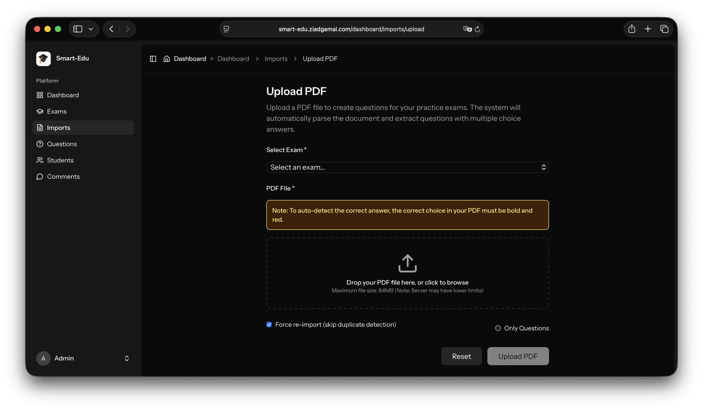
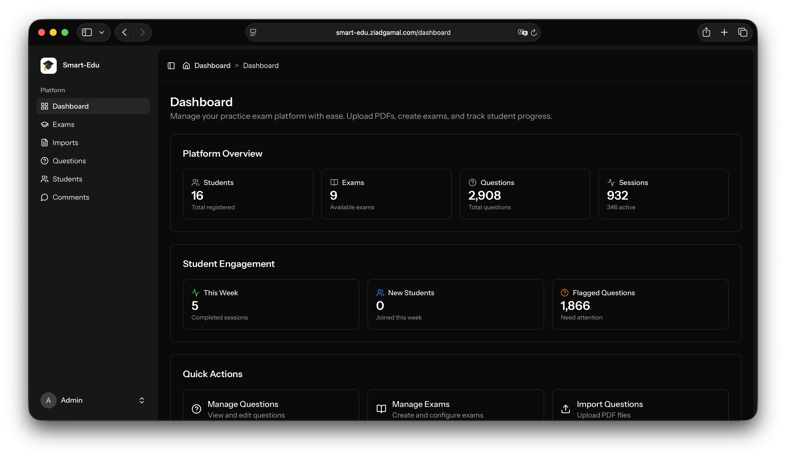
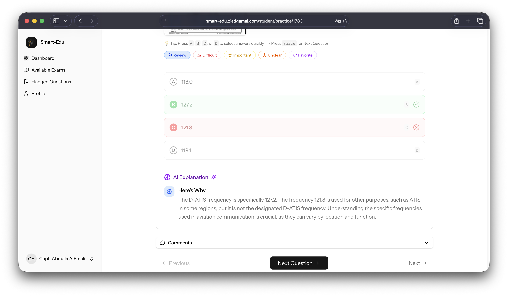

# Smart-Edu: Intelligent Exam Platform

> **Automated PDF question extraction with 99.61% accuracy - Transform paper exams into digital practice tests in minutes.**

---

## 🎯 What is Smart-Edu?

Smart-Edu automates the digitization of multiple-choice question exams from PDF files. Instead of spending days manually entering questions, the system extracts them automatically with industry-leading accuracy.

**Key Achievement**: Extracted 2,055 out of 2,063 questions (99.61%) from a single PDF in under 30 seconds.

---

## ✨ Key Features

### 🔍 Intelligent PDF Extraction
- **99.61% Accuracy** - Proven on real-world exams
- **Automatic Detection** - Finds questions, choices, and correct answers
- **Smart Pattern Recognition** - Handles complex question formats
- **Quality Validation** - Flags incomplete questions for review

### 👨‍💼 Admin Features
- **Drag & Drop Upload** - Simple PDF upload with progress tracking
- **Exam Management** - Create, organize, and manage practice exams
- **Question Review** - Review flagged questions with quality indicators
- **Import History** - Track all imports with detailed statistics

### 🎓 Student Features
- **Practice Exams** - Take unlimited practice tests
- **Instant Feedback** - Immediate results with detailed explanations
- **AI-Powered Help** - Intelligent feedback on incorrect answers
- **Progress Tracking** - Monitor performance over time

---

## 🏗️ Tech Stack

**Backend**: Laravel 12, MySQL 8.0  
**Frontend**: React 18, Inertia.js, TypeScript, Tailwind CSS  
**PDF Processing**: Python 3.10+, PyMuPDF  
**AI**: OpenAI API for intelligent feedback

---

## 📊 Results

- ⚡ **99% Time Savings** - Minutes instead of days
- ✅ **95% Error Reduction** - Automated quality control
- 📈 **Scalable** - Handle 10 to 10,000+ questions per exam
- 🎯 **Production Ready** - Deployed and operational

---

## 📸 Visual Showcase

**Quick Preview:**
- [Admin Dashboard](screenshots/03-admin-dashboard-analytics.png) - Overview and management
- [PDF Upload](screenshots/06-admin-pdf-upload.png) - Simple drag & drop interface
- [Student Exam](screenshots/12-student-exam-interface.png) - Clean exam-taking experience
- [AI Feedback](screenshots/13-student-ai-feedback.png) - Intelligent explanations

**Complete Documentation:**
- 📄 [Admin Features PDF](pdfs/admin-features.pdf) - Complete admin interface showcase (20 screenshots)
- 📄 [Student Features PDF](pdfs/student-features.pdf) - Complete student interface showcase (21 screenshots)
- 📄 [Complete Showcase PDF](pdfs/complete-showcase.pdf) - Full platform showcase with all screenshots (44 screenshots)

---

## 📚 Documentation

- 📖 **[README.md](README.md)** - Quick overview (you are here)
- 🔧 **[PROJECT.md](PROJECT.md)** - Complete technical documentation for developers and AI systems
- 🏛️ **[ARCHITECTURE.md](ARCHITECTURE.md) - Detailed system architecture

For detailed technical information, performance metrics, implementation details, and business impact, see [PROJECT.md](PROJECT.md).

---

## 🎓 Use Cases

- **Educational Institutions** - Convert paper exams to digital practice tests
- **Training Organizations** - Rapid onboarding of exam content
- **Certification Programs** - Efficient exam content management

---

## 📄 License

MIT License - See [LICENSE](LICENSE) file for details.

---

## 👨‍💻 Contact

For inquiries about this project, implementation details, or collaboration opportunities, please reach out through your preferred channel.

---

**Status**: ✅ Production Ready  
**Last Updated**: November 2025

*Built with precision, tested with rigor, deployed with confidence.* 🚀
